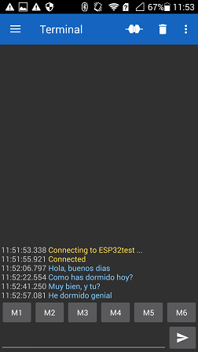

# PRÁCTICA 3B: Comunicación bluetooth con el movil


## CÓDIGO:
```
#include <Arduino.h>
#include "BluetoothSerial.h"
#if !defined(CONFIG_BT_ENABLED) || !defined(CONFIG_BLUEDROID_ENABLED)
#error Bluetooth is not enabled! Please run `make menuconfig` to and enable it
#endif
BluetoothSerial SerialBT;
void setup() {
  Serial.begin(115200);
  SerialBT.begin("ESP32test"); //Bluetooth device name
  Serial.println("The device started, now you can pair it with bluetooth!");
}

void loop() {
  if (Serial.available()) {
    SerialBT.write(Serial.read());
  }
  if (SerialBT.available()) {
    Serial.write(SerialBT.read());
  }
  delay(20);
  }

```
## FUNCIONAMIENTO:
Esta práctica, consiste en poder ver la comunicació bluetooth, entre un dispositivo bluetooth que actuara en esta caso de esclavo reciviendo mensajes que va recibir des de un dispositivo móbil, desde donde se enviaran estos mensajes. Para esto inicialmente necesitamos inicializar nuesta ESP32 para que esta sea capaz de recibir los mensajes. Para eso ejecutaremos el código que una vez subido a la placa nos permitira emparejarla con nuestro dispositivo móbil.


Para poder escribir es necesaria tener en nuestro dispositivo la siguiente aplicación:


Para connectar nuestros dispositivos, primeramente abrimos la aplicación y en el apartado de devices nos va a salir el nombre se nuestra placa "ESP32test". Cuando le damos nuestros dispositivos quedan emparejados y se nos abre un terminal donde podemos escribir. 



Cuándo escribimos des del dispositivo móbil un mensaje, este también se va a mostrar por la pantalla del ordenador mientras este monitoreando y vayamos enviando mensajes.

